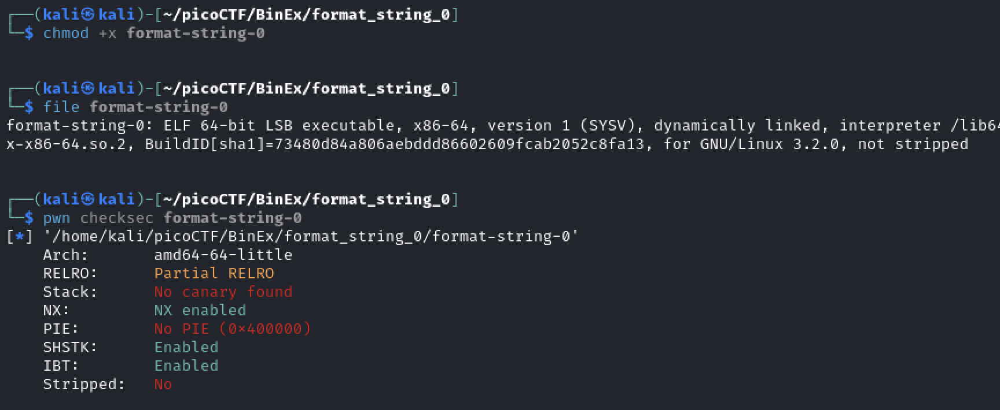
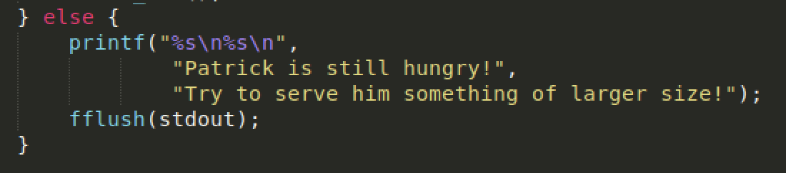

# Challenge Information

```
Description
Can you use your knowledge of format strings to make the customers happy?
Download the binary here.
Download the source here.
Additional details will be available after launching your challenge instance.
```


Downloaded binary and source.

Do some quick basics:




# Review Source
Notice that some weird printing is happening in the source code. Why would anyone print things like that?



